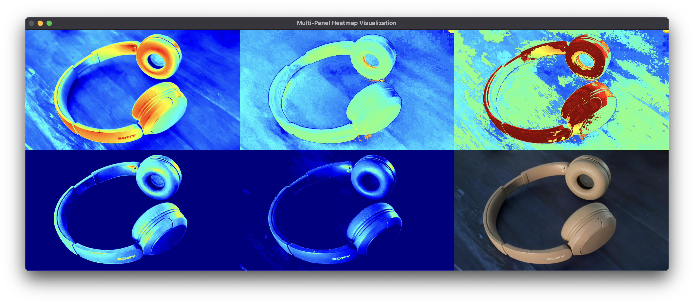

# Image Preprocessing with HSV and LAB Channels

This project introduces an experimental approach to real-time image preprocessing for computer vision pipelines. Instead of employing traditional thresholding or noise-reduction techniques, this method focuses on manipulating individual channels within HSV and LAB color spaces. By performing operations on these channels and combining them across formats, the process effectively creates layers that can be stacked allowing each layer to also act as a filter. These filters can then amplify or suppress specific features, akin to wave interference, enhancing the image in a computationally efficient manner. The resulting heatmaps provide a visual representation of these enhancements, offering insights into environmental and material details that support downstream tasks like segmentation and object recognition.

## Features

- Converts frames to HSV and LAB color spaces.
- Extracts and normalizes key channels (H, S, L) for better visualization.
- Performs operations like addition, subtraction, and bitwise operations to analyze channel relationships.
- Generates heatmaps using OpenCV's `applyColorMap` for enhanced visual insights.

## Requirements

- Python 3.7+
- OpenCV

Install the required dependencies using:

```bash
pip install opencv-python
```

## Usage

1. Clone the repository:

```bash
git clone https://github.com/Rishan22/multi-channel-visualizer.git
cd multi-channel-visualizer
```

2. Run the script:

```bash
python main.py
```

3. The script processes each frame and displays heatmaps for the following operations:
   - **Broad Map**: Weighted combination of H and S channels.
   - **Combined Map**: Bitwise OR of Broad Map and L channel.
   - **Shadows Removed**: Subtraction of S channel from L channel.
   - **Highlights Removed**: Subtraction of Broad Map from L channel.


## Key Operations

- **HSV and LAB Color Spaces**:
  - HSV: Hue, Saturation, Value
  - LAB: Lightness, A (green-red), B (blue-yellow)
- **Channel Operations**:
  - Normalization for consistent scaling.
  - Weighted addition, subtraction, and bitwise operations to highlight specific features.

## Example Output

The processed frames will display comparisons of the generated heatmaps.



## Contributing

Contributions are welcome, feel free to fork the repository and submit a pull request.

## License

This project is licensed under the MIT License. See the `LICENSE` file for details.

